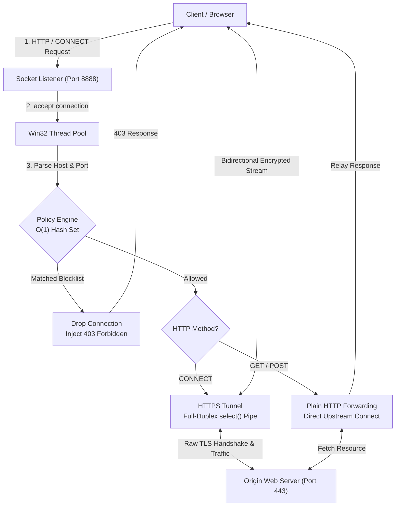

# CloudProxy – High-Performance C++ Multi-Threaded HTTP/HTTPS Proxy & Traffic Inspector

A high-concurrency, multithreaded forward proxy server engineered in modern C++ utilizing raw Windows Sockets (Winsock2) and the native Win32 API. Designed to simulate enterprise perimeter traffic inspection (similar to Zscaler Internet Access), policy-based domain filtering (Zero Trust), and bidirectional encrypted stream forwarding.

---

## Architecture Overview

## Architecture Overview

Key Technical Features
1. Multi-Threaded Concurrency Model
Spawns detached native Win32 worker threads (CreateThread) per accepted TCP client socket connection.

Completely eliminates listener bottlenecks; worker threads process I/O asynchronously while the primary server thread continuously processes incoming connection requests via accept().

2. Zero Trust Policy Enforcement & Domain Blacklisting
Implements an in-memory hash set (std::unordered_set<std::string>) to evaluate client destination hosts in O(1) time complexity.

Drops connection attempts to blacklisted/unauthorized domains before any upstream TCP handshake occurs, returning an RFC-compliant HTTP/1.1 403 Forbidden response payload with policy violation diagnostics.

3. HTTPS CONNECT Tunneling & I/O Multiplexing
Implements transparent TLS/SSL pass-through using the HTTP CONNECT tunneling protocol.

Once the upstream connection succeeds, the proxy notifies the client (HTTP/1.1 200 Connection Established) and transitions to an opaque byte-piping state.

Utilizes synchronous I/O multiplexing (select()) with non-blocking polling loops and configurable socket timeouts to coordinate bidirectional client <-> remote traffic without thread starvation or race conditions.

4. Low-Level Berkeley / Winsock API Management
Bypasses third-party networking abstractions to interface directly with the operating system's networking stack:

Network lifecycle management: WSAStartup, socket, setsockopt (SO_REUSEADDR), bind, listen, accept, closesocket, WSACleanup.

Name resolution & remote connection: gethostbyname, htons, connect.

Transport layer streaming: send, recv over stack buffers with proper boundary checks.

Protocol Lifecycle & Request Flow
A. HTTP Forward Proxy Flow (Plaintext)
Client issues GET http://example.com/index.html HTTP/1.1 to proxy port 8888.

CloudProxy parses the Host header and URL path to determine destination domain and port (default: 80).

Policy Engine checks if the destination domain exists in the restricted domain database.

Proxy establishes a secondary outbound TCP socket to the destination web server, re-transmits the original request payload, and streams back the incoming server response directly to the client socket.

B. HTTPS Tunneling Flow (Encrypted TLS)
Client issues CONNECT www.google.com:443 HTTP/1.1.

CloudProxy intercepts the handshake, extracts host (www.google.com) and port (443), and checks policy rules.

Proxy initiates a raw TCP connection to www.google.com:443.

Proxy responds to client: HTTP/1.1 200 Connection Established\r\n\r\n.

Client & Server perform TLS handshake directly through the proxy. CloudProxy relays raw encrypted bytes bidirectionally using select() until connection termination.

Compilation and Build
Prerequisites
Windows OS (7 / 10 / 11)

MinGW-w64 (GCC 8.0+) or Microsoft Visual Studio C++ Compiler (MSVC)

Build Instructions (MinGW / GCC)
Bash
# Compile using C++17 linking against Windows Sockets library (ws2_32)
g++ -std=c++17 proxy.cpp -o cloudproxy.exe -lws2_32
Build Instructions (MSVC via Developer Command Prompt)
DOS
cl /EHsc /std:c++17 proxy.cpp ws2_32.lib
Verification & Testing
1. Launch Server
Bash
./cloudproxy.exe
Expected Console Output:

Plaintext
[+] CloudProxy Server started on port 8888 (Windows C++)
2. Verify Policy Blocking (Zero Trust Simulation)
Test connection to a blacklisted domain (example.com):

Bash
curl.exe -x [http://127.0.0.1:8888](http://127.0.0.1:8888) [http://example.com](http://example.com) -I
Expected Response:

HTTP
HTTP/1.1 403 Forbidden
Content-Type: text/plain
Connection: close

Access Denied: The destination violates CloudProxy zero-trust policy.
3. Verify HTTPS Tunneling & Outbound Routing
Test encrypted pass-through to an external domain:

Bash
curl.exe -x [http://127.0.0.1:8888](http://127.0.0.1:8888) [https://www.google.com](https://www.google.com) -I
Expected Response:

HTTP
HTTP/1.1 200 OK
Future Roadmap & Performance Enhancements
[ ] Transition from select() to asynchronous I/O Completion Ports (IOCP) for scalable C10K connection handling.

[ ] Integration of OpenSSL for explicit Man-In-The-Middle (MITM) SSL inspection and dynamic certificate forging.

[ ] Dynamic policy reload via file watcher threads without requiring server process restarts.